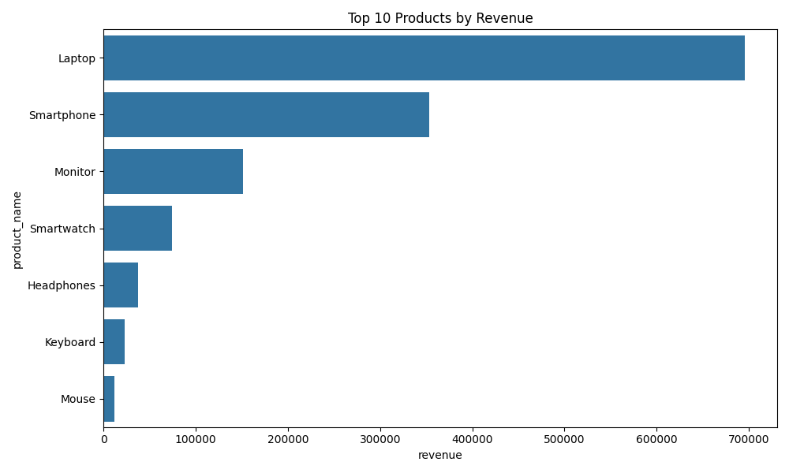
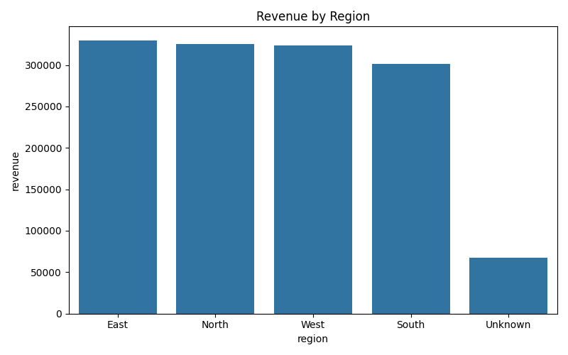
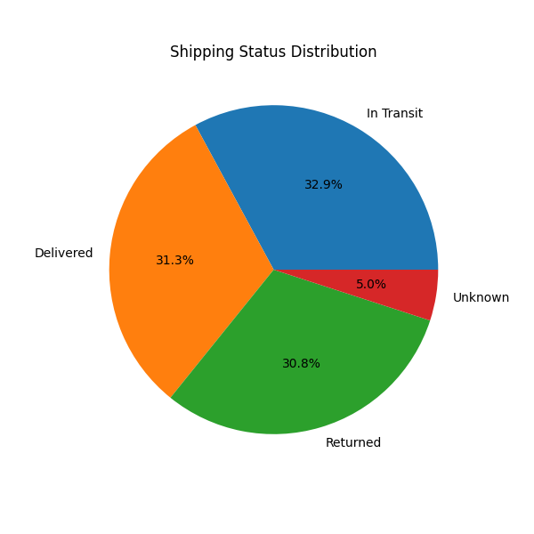

# E-Commerce Sales Analysis & Dashboard

## Project Overview

This project analyzes e-commerce sales data to uncover revenue drivers, identify loss-making products, and generate actionable business insights to improve overall profitability.

The analysis pipeline includes:
- Data cleaning and preprocessing
- KPI generation
- Product and category analysis
- Regional sales analysis
- Time-series trend analysis
- Customer demographic analysis
- Profitability analysis
- Business recommendations
- Dashboard-ready JSON exports
- Automated chart generation

## Business Objective

Analyze sales data to uncover revenue drivers, identify loss-making areas, and provide actionable recommendations to improve overall profitability.

## Dataset Information

The dataset contains realistic e-commerce transaction data with the following fields:

- Customer ID
- Gender
- Region
- Age
- Product Name
- Category
- Unit Price
- Quantity
- Total Price
- Shipping Fee
- Shipping Status
- Order Date

## Technologies Used

- Python
- Pandas
- NumPy
- Matplotlib
- Seaborn
- JSON
- Git & GitHub

## Key Features

### Data Cleaning
- Removed invalid and missing records
- Standardized column names
- Processed datetime fields
- Created age groups and time features

### KPI Metrics
- Total Revenue
- Total Profit
- Average Order Value
- Profit Margin
- Total Units Sold
- Return Rate
- Delivery Rate

### Product Analysis
- Top-performing products
- Revenue contribution analysis
- Loss-making product detection

### Regional Analysis
- Revenue by region
- Order distribution
- Regional performance comparison

### Customer Insights
- Revenue by gender
- Revenue by age group
- Top customers by revenue

### Trend Analysis
- Monthly revenue trends
- Quarterly performance
- Revenue moving averages
- Growth percentage analysis

### Operational Insights
- Shipping status distribution
- Return analysis
- Shipping impact on profitability

## Project Structure

ecommerce-sales-analysis-dashboard/                                                                                          
│                                                                                                                            
├── charts/                                                                                                                  
│   ├── monthly_revenue_trend.png                                                                                            
│   ├── top_products. png                                                                                                    
│   ├── region_revenue.png                                                                                                   
│   └── shipping_status.png                                                                                                  
│                                                                                                                            
├── dashboard_data.json                                                                                                      
├── monthly_summary.csv                                                                                                      
├── region_summary.csv                                                                                                       
├── sales_clean.csv                                                                                                          
├── top_products.csv                                                                                                         
├── realistic_e_commerce_sales_data.csv                                                                                      
├── sales_analysis.py                                                                                                        
└── README.md

## Generated Visualizations

### Monthly Revenue Trend

### Top Products by Revenue

### Revenue by Region

### Shipping Status Distribution

## Key Business Insights

- Identified top-performing products contributing the highest revenue
- Detected low-profit and loss-making products
- Analyzed customer demographics and purchasing behavior
- Evaluated regional sales performance
- Tracked monthly and quarterly revenue growth trends
- Generated actionable business recommendations

## Outputs Generated

The script automatically generates:

### Cleaned Data
- `sales_clean.csv`

### Dashboard Export Files
- `dashboard_data.json`

### Analysis Tables
- `monthly_summary.csv`
- `region_summary.csv`
- `top_products.csv`

### Charts
- Revenue trends
- Product analysis charts
- Regional analysis charts
- Shipping analysis charts

---

## Future Improvements

- Interactive Power BI dashboard
- Sales forecasting model
- Customer segmentation using machine learning
- SQL database integration
- Real-time dashboard deployment
- Profit prediction models

## License

This project is for educational and portfolio purposes.
